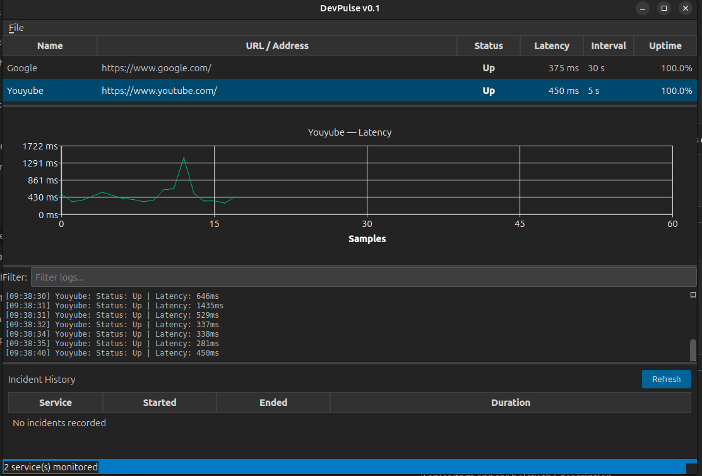

# DevPulse

A real-time developer service monitoring dashboard built with **Qt5/C++**.
Monitor your local HTTP APIs, databases, and background workers from a single dashboard.

## Screenshot



## Features

### Core Monitoring
- Add and monitor HTTP and TCP services (localhost:3000, localhost:5432 etc)
- Async health checks — never blocks the UI thread
- Three service states — **Up**, **Degraded** (slow), **Down**
- Configurable check interval, timeout, and degraded threshold per service
- Response time measurement in milliseconds

### Visualisation
- Live latency graph per service (QChart / QLineSeries) with auto-scaling Y axis
- Color-coded status — teal for Up, orange for Degraded, red for Down
- Uptime percentage tracker with rolling window calculation
- Per-service timestamped log panel with live filter

### Alerts
- Desktop notification on service Down and Recovery
- System tray icon showing overall health indicator
- Tray right-click menu — show/hide/quit
- Webhook alerts — POST to Slack, Discord, or any custom endpoint on state change

### Persistence
- SQLite database storing full check history across restarts
- Incident timeline — every outage with start time, end time, and duration
- Save/load service configs as JSON profiles
- Auto-reload last profile on startup (QSettings)

### Observability
- Prometheus-compatible `/metrics` endpoint on port 9898
- Integrates with Grafana/Prometheus stacks out of the box
- Exposes: `devpulse_service_up`, `devpulse_latency_ms`, `devpulse_uptime_percent`

### Plugin System
- Load custom protocol checkers as `.so` shared libraries at runtime
- No recompilation needed — drop a plugin into the plugins folder
- `ICheckerPlugin` interface for implementing custom checkers (gRPC, Redis, WebSocket etc)

### Utility
- Right-click context menu — Check Now, Edit, Copy URL, Remove
- Edit existing service — modify name, URL, interval without removing
- Export logs to text file
- Dark theme UI (Qt Style Sheets)
- Manual "Check Now" trigger per service

## Architecture

```
devpulse/
├── src/
│   ├── core/                    # Pure backend — zero Qt widgets
│   │   ├── Service.h            # Domain model (Q_GADGET, enum class)
│   │   ├── ServiceRepository    # In-memory store with Qt signals
│   │   ├── MonitorEngine        # Timer-driven check orchestration
│   │   ├── PrometheusServer     # Embedded QTcpServer metrics endpoint
│   │   ├── WebhookAlerter       # Slack/Discord webhook POST alerts
│   │   ├── checkers/
│   │   │   ├── IChecker.h       # Pure abstract interface
│   │   │   ├── HttpChecker      # QNetworkAccessManager async HTTP
│   │   │   ├── TcpChecker       # QTcpSocket async TCP connect
│   │   │   └── CheckerFactory   # Factory pattern — scheme dispatch
│   │   ├── monitoring/
│   │   │   ├── LatencyStore     # Circular buffer — O(1) insert
│   │   │   ├── UptimeTracker    # Rolling window uptime calculation
│   │   │   └── IncidentTracker  # Outage detection from SQLite history
│   │   ├── plugins/
│   │   │   ├── ICheckerPlugin.h # Plugin interface (Q_DECLARE_INTERFACE)
│   │   │   └── PluginLoader     # QPluginLoader runtime .so loading
│   │   └── storage/
│   │       ├── DatabaseManager     # SQLite via Qt SQL module
│   │       └── JsonProfileManager  # QJsonDocument serialisation
│   ├── models/                  # Qt MVC — bridge between core and UI
│   │   ├── ServiceTableModel    # QAbstractTableModel
│   │   └── LogModel             # QAbstractListModel
│   └── ui/                      # All QWidget/QMainWindow code
│       ├── MainWindow           # Application shell
│       ├── LatencyGraphWidget   # QChart live graph
│       ├── LogPanelWidget       # Log display with QSortFilterProxyModel
│       ├── TrayManager          # QSystemTrayIcon + notifications
│       ├── IncidentPanel        # Outage timeline table
│       └── dialogs/
│           └── AddServiceDialog # Service configuration dialog
├── plugins/
│   └── ping_checker/            # Example plugin — demonstrates ICheckerPlugin
└── tests/                       # Google Test unit tests (38 tests)
```

## Key Design Decisions

**IChecker Interface + Factory Pattern** — All checkers implement a pure abstract interface.
`CheckerFactory` centralises dispatch — callers never instantiate concrete types.
Adding a new protocol requires implementing `IChecker` and registering it in the factory.

**Plugin System** — `QPluginLoader` loads `.so` files at runtime.
The factory checks plugins first before falling back to built-in checkers.
Custom protocol support (gRPC, Redis, WebSocket) requires zero changes to the main app.

**QAbstractTableModel** — Service data is fully decoupled from rendering.
The view asks the model for data — the model never touches the UI.
Multiple views can observe the same model simultaneously.

**Circular Buffer** — Latency history uses a fixed-size ring buffer.
O(1) insert, fixed memory footprint regardless of uptime.
No allocations after startup.

**Repository Pattern** — `ServiceRepository` is the single source of truth.
All mutations go through the repository, which emits Qt signals.
UI components observe signals and never poll.

**SQLite Persistence** — Every check result is stored via Qt SQL module.
`IncidentTracker` queries consecutive DOWN records to calculate outage duration.
Uptime % is queryable over configurable rolling windows.

## Build

### Requirements

| Dependency | Version |
|------------|---------|
| Qt | 5.15+ |
| CMake | 3.16+ |
| GCC / Clang | 9+ / 10+ |
| Ninja | Any |
| Google Test | 1.14+ |

### Install Dependencies (Ubuntu/Debian)

```bash
sudo apt install \
  qtbase5-dev \
  libqt5charts5-dev \
  libqt5sql5-sqlite \
  libgtest-dev \
  cmake \
  ninja-build \
  build-essential
```

### Build and Run

```bash
git clone https://github.com/Negi2110/devpulse.git
cd devpulse
cmake -B build -G Ninja
cmake --build build
./build/Qt_5_15_13_qt5-Debug/devpulse
```

### Run Tests

```bash
cd build/Qt_5_15_13_qt5-Debug
ctest --output-on-failure
```

## Usage

### Adding a Service

```
File → Add Service  (Ctrl+N)

Name:               Auth API
URL / Address:      http://localhost:3000
Check Interval:     30 sec
Degraded Threshold: 2000 ms
```

### TCP Services (databases, Redis etc)

```
Name:               Postgres
URL / Address:      localhost:5432
```

### Prometheus Metrics

```bash
curl http://localhost:9898/metrics
```

```
# HELP devpulse_service_up 1 if service is up, 0 if down
devpulse_service_up{service="Auth API"} 1
devpulse_latency_ms{service="Auth API"} 234
devpulse_uptime_percent{service="Auth API"} 99.50
```

### Webhook Alerts

```
File → Configure Webhook
```

Paste a Slack, Discord, or webhook.site URL.
DevPulse will POST when any service goes Down or recovers.

### Custom Plugins

Drop a compiled `.so` implementing `ICheckerPlugin` into `plugins/bin/`.
DevPulse loads it on next startup — no recompilation needed.

### Right-Click Menu

Right-click any service row:
- **Check Now** — trigger an immediate health check
- **Copy URL** — copy the service URL to clipboard
- **Remove** — stop monitoring and remove from list

## Tech Stack

| Component | Technology |
|-----------|------------|
| UI Framework | Qt5 Widgets |
| Charts | Qt5 Charts (QChart, QLineSeries) |
| HTTP Checks | Qt5 Network (QNetworkAccessManager) |
| TCP Checks | Qt5 Network (QTcpSocket) |
| Metrics Server | Qt5 Network (QTcpServer) |
| Database | SQLite via Qt5 SQL |
| Build System | CMake 3.16+ with Ninja |
| JSON | Qt5 JSON (QJsonDocument) |
| Config | QSettings |
| Notifications | QSystemTrayIcon |
| Plugins | QPluginLoader |
| Testing | Google Test 1.14 / CTest |
| CI | GitHub Actions |
| Language | C++17 |

## CI Status


## Author

Aman Negi
[github.com/Negi2110](https://github.com/Negi2110)
